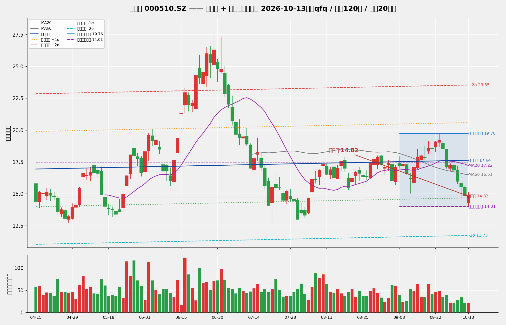
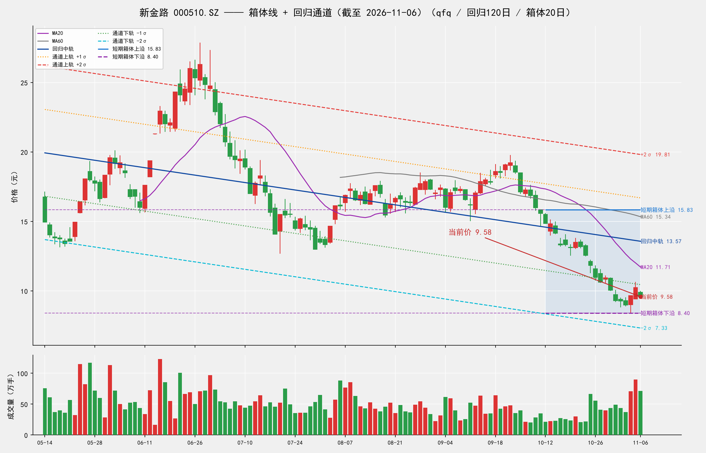
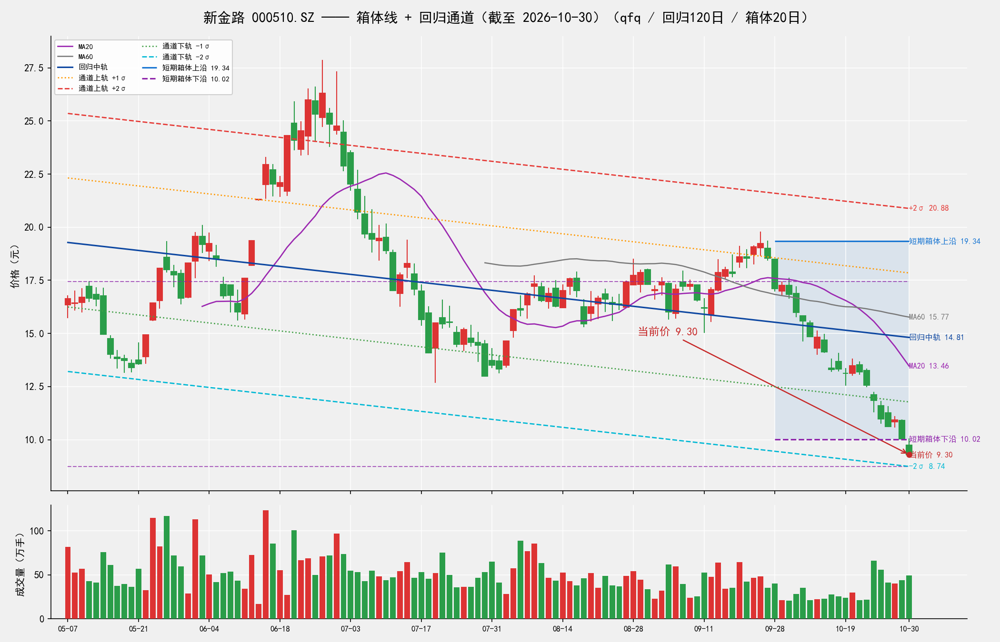
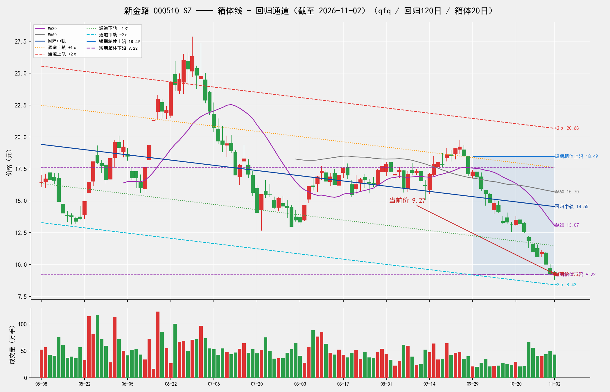
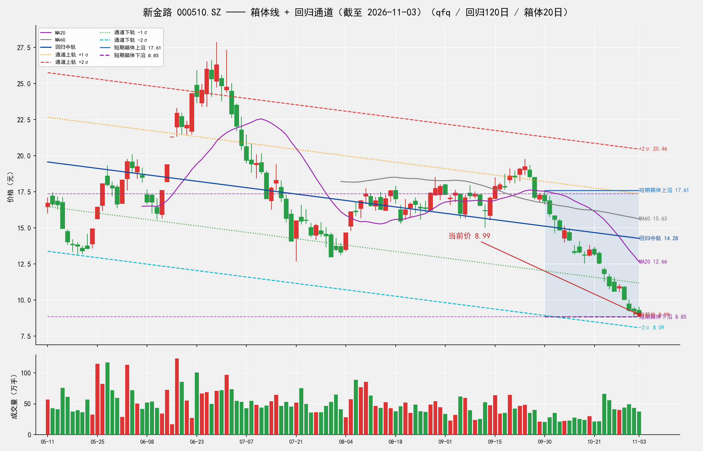
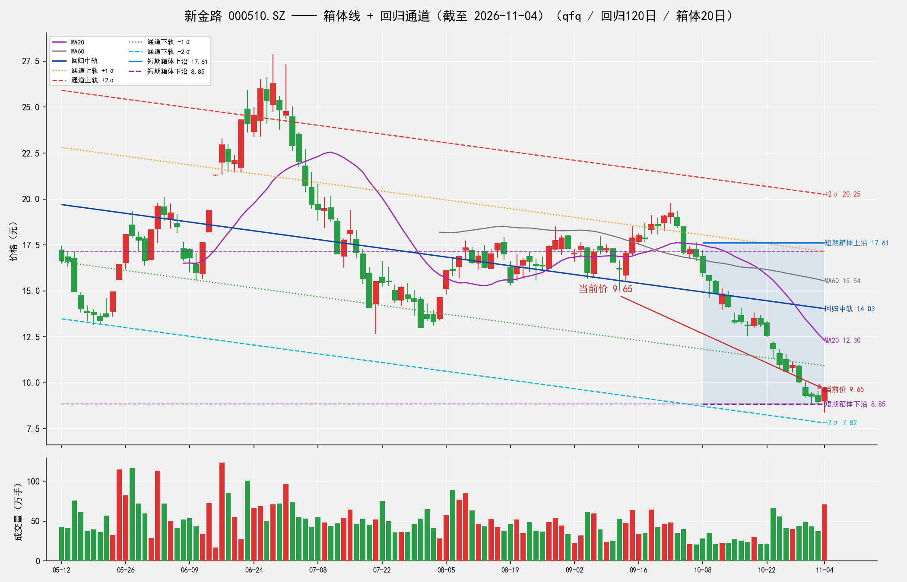
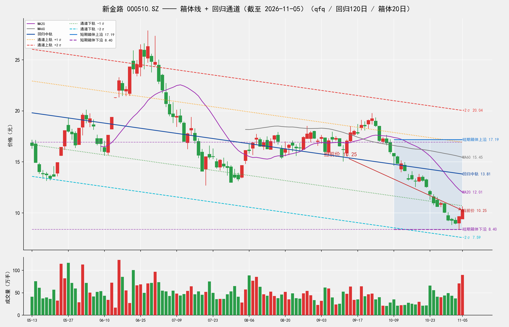

# DrX-新金路箱体回归模拟交易

**DrX Quantitative Research** · 2026年10月14日 · 每日 17:00 更新

> 30 万元虚拟资金，基于箱体回归分析的机械化模拟交易。全程记录信号、成交、资金曲线。

<!-- DAILY-CARD:START -->

## 今日操作（2026-11-09 盘前）

- 目前持仓：5,700 股新金路，成本 9.22 元；现金 239,821.35 元（截至 2026-11-06 收盘，权益 294,427.35 元，累计 -1.86%）
**今天怎么做：**
- 止盈卖单：涨到 14.55 元，卖 2,800 股
- 止盈卖单：涨到 16.64 元，卖 2,900 股（剩余全部）
- 止损单：盘中跌到 8.38 元，无条件卖出全部 5,700 股

> 本卡每天早晚轮动更新，只显示当天内容；历史记录见下方「每日记录」。

<!-- DAILY-CARD:END -->

## 一、模拟规则（v2，A股 T+1 适配版）

**标的**：新金路 (000510.SZ)

**信号生成**（每日 17:00，基于截至当日收盘的 boxreg 分析 + trade_plan）：
- 动态仓位：上升通道最高 60% / 横向 50% / 下降 25% 或空仓（结合箱体质量）
- Box_Position ≤ 0.25 → **BUY**（限价=箱体下沿，分两步建仓）
- Box_Position ≥ 0.75 → **SELL**（三阶分批止盈 3:4:3）
- 盘中跌破锁定硬止损线 → **STOP_LOSS**（按预设止损价盘中成交，跳空低开跌破按开盘价；买入当日触发不可卖，次日开盘无条件平仓）

**T+1 分步建仓**：
- T 日：试探仓（目标仓位的 60%），限价=箱体下沿
- T+1 日：若 T 日收盘守住硬止损线，加确认仓（目标仓位的 40%）；若跌破，T+1 开盘止损试探仓

**成交判定**（穿透缓冲 0.01 元）：
- BUY：盘中 Low ≤ 限价 - 0.01 才成交；开盘跳空低开超 1.5% 则撤单
- SELL：盘中 High ≥ 限价 + 0.01 才成交

**硬止损**：锁定入场箱体下沿 - max(1.0×ATR, 20%箱体高度, 2.5%防毛刺)，持仓期间不随箱体重算漂移。每个交易日盘中都生效（以当日最低价是否触及止损价判定触发、以止损价成交），与当日挂单如何处置无关（包括 T1 确认单被跳空取消的情形）。模拟成交一律按预设价格盘中执行，与限价买入、阶梯止盈同口径，不按收盘价结算。

**三阶止盈**（3:4:3）：
- TP1 30% @ max(箱体中轴, 回归中轨)；硬止损在持仓期间锁定入场时算出的价格不变，TP1 成交后不上移至保本
- TP2 40% @ 箱体 0.80 分位
- TP3 30% @ min(箱体上沿, +2σ)

**费用**：佣金万三（最低 5 元）双边；印花税 0.1% 仅卖出。

## 二、启动分析（2026-10-14）

基于 2026-10-13 收盘数据的 boxreg 分析（已修复箱体破位自适应下移漏洞）：

| 指标 | 数值 |
|---|---|
| 收盘价 (10-13) | 14.82 |
| 箱体上沿 / 下沿 | 18.98 / 15.68 |
| 当前价位置 | **箱体下方（破位）** |
| 硬止损线 | 15.02 |
| 回归趋势 | 横向（β=+0.0058/日） |

**关键修正**：10-13 日最低价 14.01 跌破原箱体下沿。修复前代码会自动把箱体下沿下移至 14.01 并继续提示买入（死锁 bug）；修复后箱体锁定在 15.68–18.98，正确识别为**破位**，今日**不买入、空仓观望**。

**首日信号**：HOLD（破位观望）。等待价格重回箱体或形成新箱体后再行动。

## 最新 boxreg 图（每日更新）

截至 **2026-11-06 收盘**重算：当前价 9.58，MA20 11.71，MA60 15.34，回归中轨 13.57，箱体 8.40–15.83，+2σ 19.81 / -2σ 7.33。此图每日 17:00 用当日收盘数据重新计算（K线、MA20/MA60、回归通道、箱体全部更新），下方每日记录中另存当日图。

## 三、每日记录

### 2026-10-14（收盘）
- 今日行情：开 14.68 / 高 14.97 / 低 14.11 / **收 14.14**（-4.59%，昨日收 14.82）
- boxreg（截至今日收盘重算）：箱体 **15.05–19.76**（中轴 17.41），回归趋势横向（β=+0.0033/日）；Box位置 **-0.19**，收盘仍在箱体下沿下方 → 破位状态延续
- 昨日信号成交情况：前一日信号为 HOLD，无挂单，今日无成交
- 本次信号：**HOLD（破位观望）**——trade_plan 判定向下破位，当前无持仓故无止损动作，不开新仓
- 资金：**300,000.00 元（现金）**，持仓 0 股；累计收益 **0.00 元（0.00%）**

### 2026-10-15（收盘）
- 今日行情：开 13.37 / 高 13.79 / 低 13.21 / **收 13.30**（-5.94%，昨日收 14.14）
- boxreg（截至今日收盘重算）：箱体 **15.01–18.98**（中轴 17.00）；Box位置 **-0.43**，收盘仍在箱体下沿下方 → 破位状态延续（箱体下沿锁定有效，未随新低 13.21 自适应下移）
- 昨日信号成交情况：前一日信号为 HOLD（破位观望），无挂单，今日无成交
- 本次信号：**HOLD（破位观望）**——trade_plan 判定 STOP_LOSS 破位（当前价 13.30 跌破止损线 14.22），但当前无持仓故无止损动作，不开新仓
- 资金：**300,000.00 元（现金）**，持仓 0 股；累计收益 **0.00 元（0.00%）**

### 2026-10-16（收盘）
- 今日行情：开 13.68 / 高 14.06 / 低 13.24 / **收 13.32**（+0.15%，昨日收 13.30）
- boxreg（截至今日收盘重算）：箱体 **14.81–18.98**（中轴 16.90）；Box位置 **-0.36**，收盘仍在箱体下沿下方 → 破位状态延续（箱体下沿锁定有效，未随新低 13.24 自适应下移）
- 昨日信号成交情况：前一日信号为 HOLD（破位观望），无挂单，今日无成交
- 本次信号：**HOLD（破位观望）**——trade_plan 判定 STOP_LOSS 破位（当前价 13.32 跌破止损线 13.98），但当前无持仓故无止损动作，不开新仓
- 资金：**300,000.00 元（现金）**，持仓 0 股；累计收益 **0.00 元（0.00%）**

### 2026-10-19（收盘）
- 今日行情：开 13.13 / 高 13.34 / 低 12.56 / **收 13.12**（-1.50%，昨日收 13.32）
- boxreg（截至今日收盘重算）：箱体 **14.542–18.98**（中轴 16.76）；Box位置 **-0.32**，收盘仍在箱体下沿下方 → 破位状态延续
- 昨日信号成交情况：前一日信号为 HOLD（破位观望），无挂单，今日无成交
- 本次信号：**HOLD（破位观望）**——trade_plan 判定 STOP_LOSS 破位（当前价 13.12 跌破止损线 13.65），但当前无持仓故无止损动作，不开新仓
- 资金：**300,000.00 元（现金）**，持仓 0 股；累计收益 **0.00 元（0.00%）**

### 2026-10-20（收盘）
- 今日行情：开 13.12 / 高 13.80 / 低 13.03 / **收 13.49**（+2.82%，昨日收 13.12）
- boxreg（截至今日收盘重算）：箱体 **14.09–18.98**（中轴 16.54）；Box位置 **-0.12**，收盘仍在箱体下沿下方 → 破位状态延续
- 昨日信号成交情况：前一日信号为 HOLD（破位观望），无挂单，今日无成交
- 本次信号：**HOLD（破位观望）**——trade_plan 判定 STOP_LOSS 破位（当前价 13.49 触及止损线 13.11 一带），但当前无持仓故无止损动作，不开新仓
- 资金：**300,000.00 元（现金）**，持仓 0 股；累计收益 **0.00 元（0.00%）**

### 2026-10-21（收盘）
- 今日行情：开 13.52 / 高 13.66 / 低 13.08 / **收 13.19**（-2.22%，昨日收 13.49）
- boxreg（截至今日收盘重算）：箱体 **13.86–18.98**（中轴 16.42）；Box位置 **-0.13**，收盘仍在箱体下沿下方 → 破位状态延续
- 昨日信号成交情况：前一日信号为 HOLD（破位观望），无挂单，今日无成交
- 本次信号：**HOLD（破位观望）**——trade_plan 判定 STOP_LOSS 破位（向下破位状态延续），但当前无持仓故无止损动作，不开新仓
- 资金：**300,000.00 元（现金）**，持仓 0 股；累计收益 **0.00 元（0.00%）**

### 2026-10-22（收盘）
- 今日行情：开 13.25 / 高 13.33 / 低 12.50 / **收 12.56**（-4.78%，昨日收 13.19）
- boxreg（截至今日收盘重算）：箱体 **13.23–18.98**（中轴 16.11）；Box位置 **-0.12**，收盘仍在箱体下沿下方 → 破位状态延续
- 昨日信号成交情况：前一日信号为 HOLD（破位观望），无挂单，今日无成交
- 本次信号：**HOLD（破位观望）**——trade_plan 判定 STOP_LOSS（向下破位状态延续，价格未收回箱体下沿 13.23），但当前无持仓故无止损动作，不开新仓
- 资金：**300,000.00 元（现金）**，持仓 0 股；累计收益 **0.00 元（0.00%）**

### 2026-10-23（收盘）
- 今日行情：开 12.12 / 高 12.23 / 低 11.30 / **收 11.84**（-5.73%，昨日收 12.56）
- boxreg（截至今日收盘重算）：箱体 **13.184–18.98**（中轴 16.08）；Box位置 **-0.23**，收盘仍在箱体下沿下方 → 破位状态延续（箱体下沿锁定有效，未随新低 11.30 自适应下移）
- 昨日信号成交情况：前一日信号为 HOLD（破位观望），无挂单，今日无成交
- 本次信号：**HOLD（破位观望）**——trade_plan 判定 STOP_LOSS 破位（当前价 11.84 跌破止损线 12.25），但当前无持仓故无止损动作，不开新仓
- 资金：**300,000.00 元（现金）**，持仓 0 股；累计收益 **0.00 元（0.00%）**

### 2026-10-26（收盘）
- 今日行情：开 11.60 / 高 11.80 / 低 10.78 / **收 10.98**（-7.26%，昨日收 11.84）
- boxreg（截至今日收盘重算）：箱体 **13.07–18.98**（中轴 16.03）；Box位置 **-0.35**，收盘仍在箱体下沿下方 → 破位状态延续
- 昨日信号成交情况：前一日信号为 HOLD（破位观望），无挂单，今日无成交
- 本次信号：**HOLD（破位观望）**——trade_plan 判定 STOP_LOSS 破位（当前价 10.98 跌破止损线 12.11），但当前无持仓故无止损动作，不开新仓
- 资金：**300,000.00 元（现金）**，持仓 0 股；累计收益 **0.00 元（0.00%）**

### 2026-10-27（收盘）
- 今日行情：开 11.26 / 高 11.55 / 低 10.61 / **收 10.62**（-3.28%，昨日收 10.98）
- boxreg（截至今日收盘重算）：箱体 **12.94–18.58**（中轴 15.76）；Box位置 **-0.41**，收盘仍在箱体下沿下方 → 破位状态延续
- 昨日信号成交情况：前一日信号为 HOLD（破位观望），无挂单，今日无成交
- 本次信号：**HOLD（破位观望）**——trade_plan 判定 STOP_LOSS 破位（当前价 10.62 跌破止损线 11.98），但当前无持仓故无止损动作，不开新仓
- 资金：**300,000.00 元（现金）**，持仓 0 股；累计收益 **0.00 元（0.00%）**

### 2026-10-28（收盘）
- 今日行情：开 10.84 / 高 11.09 / 低 10.59 / **收 10.94**（+3.01%，昨日收 10.62）
- boxreg（截至今日收盘重算）：箱体 **10.61–19.76**（中轴 15.19）；Box位置 **0.04**，收盘位于箱体下沿附近
- 昨日信号成交情况：前一日信号为 HOLD（破位观望），无挂单，今日无成交
- 本次信号：**BUY（限价买入）**——Box位置 0.04 ≤0.25，次日挂 T0 试探买单 8400 股 @ 10.61（盘中最低 ≤10.60 判定成交；若成交，次日再挂 T1 确认买单 5600 股，硬止损 9.72）
- 资金：**300,000.00 元（现金）**，持仓 0 股；累计收益 **0.00 元（0.00%）**

### 2026-10-29（收盘）
- 今日行情：开 10.91 / 高 10.94 / 低 10.02 / **收 10.04**（-8.23%，昨日收 10.94）
- boxreg（截至今日收盘重算）：箱体 **10.59–19.76**（中轴 15.18），回归趋势下行（β=-0.0336/日）；Box位置 **-0.06**，收盘跌回箱体下沿下方 → 向下跌破箱体
- 昨日信号成交情况：昨日 BUY 信号的 T0 试探买单今日成交：盘中最低 10.02 ≤ 10.60，买入 **8400 股 @ 10.61**，锁定箱体 [10.61, 19.76]，硬止损 9.72
- 本次信号：**T1 确认买单待明日判定**——trade_plan 判定 STOP_LOSS（向下跌破箱体），但收盘 10.04 仍高于锁定硬止损 9.72，按脚本 T+1 规则明日先执行 T1 判定：挂 T1 确认买单 **5600 股 @ 10.61**（盘中最低 ≤10.60 判定成交；若明日判定日收盘已破硬止损则改为开盘止损，脚本以锁定硬止损 9.72 为准）
- 资金：权益 **295,185.26 元**（现金 210,849.26 元 + 持仓 8400 股 × 10.04），持仓 8400 股；累计收益 **-4,814.74 元（-1.60%）**

### 2026-10-30（收盘）
- 今日行情：开 9.74 / 高 10.04 / 低 9.22 / **收 9.30**（-7.37%，昨日收 10.04）
- boxreg（截至今日收盘重算）：箱体 **10.02–19.34**（中轴 14.68），回归趋势下行（β=-0.0375/日）；MA20 13.46 / MA60 15.77；Box位置 **-0.08**，收盘跌破箱体下沿 → 破位状态延续
- 昨日信号成交情况：昨日 T1 确认买单（5600 股 @ 10.61）今日**未成交、已取消**：开盘 9.74 跌破跳空保护线 10.45，触发跳空取消（昨日收盘 10.04 高于锁定硬止损 9.72，故未触发开盘止损）
- 本次信号与执行：**STOP_LOSS 已于当日盘中执行**——开盘 9.74，盘中最低 9.22 跌破锁定硬止损 9.72，按预设止损价卖出全部 **8400 股 @ 9.72**（费用 106.14 元，已实现盈亏 **-7,608.88 元**），仓位清零，不存在拖到下周一的问题
- 资金：**292,391.12 元（全现金）**，持仓 0 股；累计收益 **-7,608.88 元（-2.54%）**
- 当日 boxreg 图（截至 10-30 收盘重算）：

- **更正说明（10-31 / 11-01 两次更正）**：本条目原记录把止损拖到下周一开盘，系脚本 bug——10-30 当天 T1 确认单被跳空取消时，该分支没有补挂止盈/止损单，当日止损检查被整段跳过。10-31 第一次更正先按当日收盘价 9.30 补记；11-01 经读者指出，模拟成交的既定口径是按预设价格盘中执行（限价买入按箱体下沿价、阶梯止盈按阶梯价成交，止损同理），止损单在盘中被最低价 9.22 触及后应按止损价 9.72 成交，而不是按收盘价结算——第二次更正按 9.72 成交，两口径相差 3,523.41 元（原权益 288,969.26 元为未扣卖出费用的持仓市值口径，收盘价口径为 288,867.71 元，最终全现金 **292,391.12 元**）。脚本已修复：T1 撤单后补挂三阶止盈单；止损改为盘中触发、按止损价成交（跳空低开跌破按开盘价），并加通用兜底检查。此前发出的「周一开盘止损（A）/ 保持脚本（B）」两个选项随之作废。

### 2026-11-02（收盘）
- 今日行情：开 9.39 / 高 9.49 / 低 8.85 / **收 9.27**（-0.32%，昨日收 9.30）
- boxreg（截至今日收盘重算）：箱体 **9.22–18.49**（中轴 13.86）；MA20 13.07 / MA60 15.70；Box位置 **0.01**，收盘位于箱体下沿附近
- 昨日信号成交情况：前一日（10-30）硬止损已于当日盘中执行清仓、无待执行挂单，今日无成交
- 本次信号：**BUY（限价买入）**——Box位置 0.01 ≤0.25，次日挂 T0 试探买单 5700 股 @ 9.22（盘中最低 ≤9.21 判定成交，开盘跳空跌破 9.08 则取消；若成交，次日再挂 T1 确认买单 3800 股，硬止损 8.38）
- 资金：**292,391.12 元（全现金）**，持仓 0 股；累计收益 **-7,608.88 元（-2.54%）**
- 当日 boxreg 图（截至 11-02 收盘重算）：

### 2026-11-03（收盘）
- 今日行情：开 9.30 / 高 9.52 / 低 8.90 / **收 8.99**（-3.02%，昨日收 9.27）
- boxreg（截至今日收盘重算）：箱体 **8.85–17.61**（中轴 13.23）；MA20 12.66 / MA60 15.63；Box位置 **0.02**，收盘位于箱体下沿附近
- 昨日信号成交情况：昨日 BUY 信号的 T0 试探买单今日成交：开盘 9.30 未触发跳空取消，盘中最低 8.90 ≤ 9.21，买入 **5700 股 @ 9.22**，锁定箱体 [9.22, 18.49]，硬止损 8.38
- 本次信号：**T1 确认买单待明日判定**——今日收盘 8.99 高于锁定硬止损 8.38，明日挂 T1 确认买单 **3800 股 @ 9.22**（盘中最低 ≤9.21 判定成交；开盘跳空跌破 9.08 则取消并改挂三阶止盈单 14.55 / 16.64 / 18.49）。买入当日不可卖：今日最低 8.90 亦高于硬止损 8.38，无止损动作
- 资金：权益 **291,064.35 元**（现金 239,821.35 元 + 持仓 5700 股 × 8.99），持仓 5700 股；累计收益 **-8,935.65 元（-2.98%）**
- 当日 boxreg 图（截至 11-03 收盘重算）：

### 2026-11-04（收盘）
- 今日行情：开 9.00 / 高 9.66 / 低 8.40 / **收 9.65**（+7.34%，昨日收 8.99）
- boxreg（截至今日收盘重算）：箱体 **8.85–17.61**（中轴 13.23），回归趋势下行（β=-0.0476/日）；MA20 12.30 / MA60 15.54；Box位置 **0.09**，收盘位于箱体内部偏下沿
- 昨日信号成交情况：昨日 T1 确认买单（3800 股 @ 9.22）今日**未成交、已取消**：开盘 9.00 跌破跳空保护线 9.08（9.22×(1-1.50%)），触发跳空取消。T0 试探仓 5700 股保留，并按脚本规则改挂三阶止盈单
- 止损检查：昨日收盘 8.99 高于锁定硬止损 8.38，未触发开盘止损；今日盘中最低 8.40 亦高于锁定硬止损 8.38（仅高 0.02），未触发盘中止损，持仓保留
- 本次信号：**持有并挂三阶止盈单**——锁定箱体 [9.22, 18.49]、硬止损 8.38 不变；止盈阶梯 TP1 14.55（2800 股）/ TP2 16.64（3800 股）/ TP3 18.49（2900 股），盘中触及阶梯价即按阶梯价卖出
- 资金：权益 **294,826.35 元**（现金 239,821.35 元 + 持仓 5700 股 × 9.65），持仓 5700 股；累计收益 **-5,173.65 元（-1.72%）**
- 当日 boxreg 图（截至 11-04 收盘重算）：

### 2026-11-05（收盘）
- 今日行情：开 9.42 / 高 10.62 / 低 9.42 / **收 10.25**（+6.22%，昨日收 9.65）
- boxreg（截至今日收盘重算）：箱体 **8.40–17.19**（中轴 12.80），回归趋势下行（β=-0.0504/日）；MA20 12.01 / MA60 15.45；Box位置 **0.21**，收盘位于箱体内部偏下沿，回归中轨 13.81 下方
- 昨日信号成交情况：昨日为持有并挂三阶止盈单，今日**无成交**：盘中最高 10.62 未触及 TP1 14.55；盘中最低 9.42 高于锁定硬止损 8.38，未触发盘中止损，持仓保留
- 本次信号：**持有并挂三阶止盈单**——锁定箱体 [9.22, 18.49]、硬止损 8.38 不变；止盈阶梯 TP1 14.55（2800 股）/ TP2 16.64（3800 股）/ TP3 18.49（2900 股），盘中触及阶梯价即按阶梯价卖出。按锁定入场箱体重算 Box 位置 0.11 仍处买入区，但已持仓 5700 股且挂有止盈单，不新开仓
- 资金：权益 **298,246.35 元**（现金 239,821.35 元 + 持仓 5700 股 × 10.25），持仓 5700 股；累计收益 **-1,753.65 元（-0.58%）**
- 当日 boxreg 图（截至 11-05 收盘重算）：

### 2026-11-06（收盘）
- 今日行情：开 9.90 / 高 9.97 / 低 9.48 / **收 9.58**（-6.54%，昨日收 10.25）
- boxreg（截至今日收盘重算）：箱体 **8.40–15.83**（中轴 12.12），回归趋势下行（β=-0.0535/日）；MA20 11.71 / MA60 15.34；Box位置 **0.16**，收盘位于箱体内部偏下沿，回归中轨 13.57 下方
- 昨日信号成交情况：昨日为持有并挂三阶止盈单，今日**无成交**：盘中最高 9.97 未触及 TP1 14.55；盘中最低 9.48 高于锁定硬止损 8.38，未触发盘中止损，持仓保留
- 本次信号：**持有并挂三阶止盈单**——锁定箱体 [9.22, 18.49]、硬止损 8.38 不变；止盈阶梯 TP1 14.55（2800 股）/ TP2 16.64（3800 股）/ TP3 18.49（2900 股），盘中触及阶梯价即按阶梯价卖出。按锁定入场箱体重算 Box 位置 0.04 仍处买入区，但已持仓 5700 股且挂有止盈单，不新开仓
- 资金：权益 **294,427.35 元**（现金 239,821.35 元 + 持仓 5700 股 × 9.58），持仓 5700 股；累计收益 **-5,572.65 元（-1.86%）**
- 当日 boxreg 图（截至 11-06 收盘重算）：

---

*本模拟为量化研究记录，不构成投资建议。*
